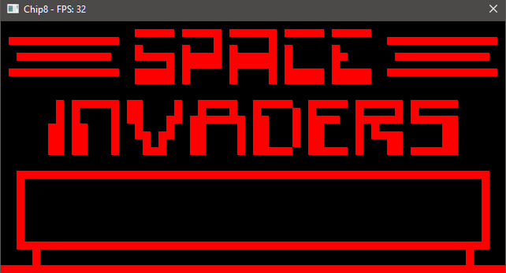
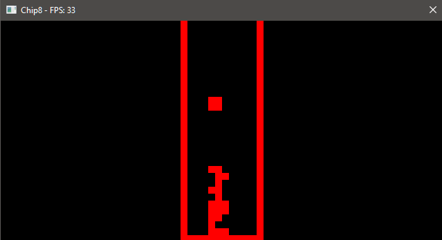

# Chip8
### This is a very very basic chip8 emulator that I built using the assistance of online resources, such as the chip8 documentation, and public repositories on chip8 (There are many many many of them on github!). I primarily used this project as an opportunity to learn more about learning c++, and lower level programming.
##### [Amazing CHIP8 documentation](http://devernay.free.fr/hacks/chip8/C8TECH10.HTM)

